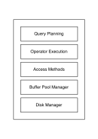

> 开始搞存储了，项目中用到的很多基础知识还是欠缺的。期望通过这个系列的博客来总结下。本文聚焦于 Parquet 这种列式存储格式——从 CMU 15-445 的知识体系出发，看看它为什么长这样，以及 InfluxDB 系统是如何使用它的。

<!--more-->

## 一、列式存储：分析型负载的必然选择

> 行存还是列存？这取决于你问的是谁。

### 1.1 从 CMU 15-445 的体系结构说起

在 CMU 15-445 的课程体系中，一个典型的数据库系统被组织为自顶向下的多个层次：



上图展示了从用户查询到物理存储所经过的五层架构。本文的主角——Parquet——并非只落在其中某一层，而是横跨了多层。下面逐层说明 Parquet 与各层的关系。

第一层：Query Planning（查询规划）。 这一层负责将 SQL 解析为逻辑计划再优化为物理执行计划。Parquet 本身不直接参与这一层的工作，但它提供的 Statistics（min/max/null_count 等）是 Predicate Pushdown（谓词下推）的关键输入——查询优化器可以利用这些元信息决定跳过哪些数据块。此外，Column Pruning（列裁剪）也是在这一层根据 Schema 信息做出的决策。所以 Parquet 虽然不"住"在这里，但它的设计深刻影响了这层的效率。

第二层：Operator Execution（操作符执行）。 这一层负责执行查询计划中的各个算子（Scan、Filter、Aggregate 等）。对于 Parquet 文件的读取操作就发生在这里——执行引擎调用 Parquet 读取库，解码 Page 中的数据，交给上层算子消费。Parquet 的列式布局使得 Scan 算子可以逐列输出数据，天然适配向量化执行（Vectorized Execution）模式。

第三层：Access Methods（访问方法）。 这一层的核心议题是如何高效地定位和存取磁盘上的数据，比如 B+ Tree、Hash Index 等索引结构。Parquet 文件本身不是通用访问方法，但它的 Footer 中包含了每个 RowGroup 和 ColumnChunk 的偏移量信息，使得读取者可以直接 seek 到目标位置而不必顺序扫描。这种"内置索引"的设计思路，与 Access Methods 层的目标是一致的——减少不必要的 I/O。

第四层：Buffer Pool Manager（缓冲池管理器）。 数据库系统通过固定大小的内存页缓存来管理磁盘数据的读写。Parquet 的 Page（默认 64KB~1MB）天然对齐了缓冲池的页粒度：读取一个 Page 就是一次缓冲池操作，Page 内部的数据可以被完整地缓存在内存中供后续复用。如果 Parquet 的 Page 大小配置合理，可以显著提升缓冲池的命中率。

第五层：Disk Manager（磁盘管理器）。 这是最底层的磁盘 I/O 抽象层，Parquet 文件最终由这一层负责读写。Parquet 的物理布局——Magic Number、RowGroup 在前、Footer 在后、文件末尾反向寻址——都是针对磁盘 I/O 特性所做的设计决策：顺序写（追加 RowGroup）、随机读（seek 到特定 ColumnChunk）、最小化打开文件的 I/O 次数（两次读取即可获取全部元信息）。

总结一下：Parquet 是一个跨越多层的设计。其编码和统计信息服务于查询规划（第一层），其数据被操作符执行层消费（第二层），其偏移量布局体现了访问方法的效率思维（第三层），其 Page 粒度适配缓冲池管理（第四层），最终以特定的文件布局经由磁盘管理器落地（第五层）。理解这个跨层定位，有助于在后续阅读 Parquet 格式细节时，时刻明白"为什么要这样设计"。

不过，上面说的五层是数据库系统的运行时架构。如果要问 "Parquet 到底是什么"，答案还要回到更根本的问题上——数据在磁盘上应该怎么摆。这正是 CMU 15-445 中 Storage Models 章节的核心议题：行存还是列存？下面从最直观的对比说起。

传统的行式存储（Row-Oriented，如 MySQL InnoDB）将一行数据的所有列连续存放在一起：

```
行存布局 (以一张 user 表为例):
┌──────────────────────────────────────────────────┐
│ id │ name   │ age │ status │ address            │
│ 1  │ "张三" │ 25  │ "OK"   │ "北京市朝阳区..."  │  ← 第1行
│ 2  │ "李四" │ 30  │ "OK"   │ "上海市浦东新区..."│  ← 第2行
│ 3  │ "王五" │ 28  │ "FAIL" │ "广州市天河区..."  │  ← 第3行
└──────────────────────────────────────────────────┘
```

这种方式的优点是单行插入和点查询非常快——一次 I/O 就能取出一整行数据。这也是为什么 OLTP（联机事务处理）场景下几乎都采用行存。

但到了 OLAP（联机分析处理）场景，查询模式完全不同了：典型的分析查询往往是 `SELECT avg(age) FROM user WHERE status = 'OK'` —— 只需要读 `age` 和 `status` 两列，却要扫描全表。

这时候行存的劣势就暴露了：即使只需要两列的数据，也不得不把 `name`、`address` 这些大字段一并读入内存，造成大量的 I/O 浪费。

### 1.2 列存的优势

列式存储（Column-Oriented）将每一列的数据连续存放：

```
列存布局 (同样的 user 表):
┌─────────────┐ ┌───────────┐ ┌──────┐ ┌────────┐ ┌──────────────────┐
│ id          │ │ name      │ │ age  │ │ status │ │ address           │
│ 1, 2, 3, ..│ │ "张三",.. │ │25,30,│ │"OK",.. │ │ "北京市朝阳区...",│
│             │ │           │ │28,.. │ │"FAIL"..│ │ "上海市浦东新区.."│
└─────────────┘ └───────────┘ └──────┘ └────────┘ └──────────────────┘
     列0           列1         列2      列3          列4
```

当执行 `SELECT avg(age) WHERE status = 'OK'` 时，列存只需要读取 `age` 和 `status` 两个列的数据块，I/O 量可能减少到原来的 1/5 甚至更少（取决于表的总列数和各列的平均宽度）。

除了 I/O 减少之外，列存还有第二个核心优势：压缩效率更高。因为同一列的数据类型相同、语义相近（比如 `status` 列大量重复 `"OK"` / `"FAIL"`），编码和压缩算法可以发挥更大的效果。后文在介绍 Parquet 编码方式时会详细展开这一点。

当然，列存也有明显的缺点：插入或更新单行数据时需要修改多个列文件，写入性能不如行存。所以列存天然适合 "写一次、读多次" 的分析型场景。

## 二、主流列存格式全景

> Parquet 不是唯一的选择，但它成为了开放生态下的最大公约数。

在 Hadoop 生态兴起之后，出现了一系列面向分析型场景的列存格式。笔者在这里对几种主流格式做一个对比。

### 2.1 格式对比

| 维度 | Apache Parquet | Apache ORC | Arrow IPC |
|------|-------------------|---------------|--------------|
| 出身 | Twitter / Cloudera → Apache | Hortonworks → Apache | Apache Arrow 社区 |
| 定位 | 磁盘列存格式（分析型存储） | 磁盘列存格式（Hive 数仓优化） | 内存列存格式（进程间交换 / 持久化） |
| 典型块大小 | RowGroup (~128MB) | Stripe (~250MB) | RecordBatch (~10万行) |
| 嵌套类型支持 | D/R Level | D/R Level | 原生嵌套 |
| 索引能力 | Min/Max 统计信息 | Light Weight Index + Bloom Filter | 无（内存格式） |
| 主要生态 | Spark, Flink, Iceberg, InfluxDB | Hive, Presto, Snowflake 内部 | Arrow 全链路生态 |

此外还有一些其他格式值得了解：

| 格式 | 定位 | 备注 |
|------|------|------|
| Apache Avro | 行存，面向序列化 | 和 Parquet 互补而非竞争；适合写多读少、schema evolution 场景 |
| Feather v2 | Arrow 的磁盘持久化 | 本质是 Arrow IPC 封装，轻量级数据交换 |
| DuckDB 自有格式 | 单机 OLAP 列存 | 类似 Parquet 但针对单机场景做了深度优化 |

### 2.2 ORC vs Parquet：一段简短的历史

回顾历史，ORC（Optimized Row Columnar）和 Parquet 曾是 Hadoop 时代两大列存格式的竞争者。ORC 由 Hortonworks 为 Hive 生态打造，在 Hive/Presto 场景下有不错的表现；Parquet 则源自 Twitter 和 Cloudera，在 Spark 生态中获得了更广泛的采纳。

最终 Spark 将 Parquet 作为默认的持久化格式，加上后续 Iceberg、Delta Lake 等 Table Format 层均以 Parquet 为基础文件格式，Parquet 逐渐成为了开放生态下的事实标准[^1]。

### 2.3 Arrow IPC 与 Parquet：分工而非竞争

Arrow IPC 和 Parquet 经常被放在一起讨论，但它们解决的是不同层面的问题：

- Arrow IPC：定义了内存中的列式数据表示（Arrow Array），以及如何将这些数据序列化为字节流用于进程间通信或磁盘持久化。它的设计目标是速度——零拷贝、无反序列化开销。
- Parquet：专门为磁盘存储设计的格式，强调压缩率和 I/O 效率。有复杂的分层结构（RowGroup → ColumnChunk → Page）、丰富的编码方式和统计信息。

两者共享同一套类型系统（Arrow Type），因此 Parquet 文件可以零拷贝地读入为 Arrow RecordBatch。这也是为什么 "Parquet 存 + Arrow 算" 成为了现代 OLAP 引擎的主流架构选择。

## 三、Parquet 格式深入

> 知其然，也要知其所以然。本节从物理布局开始，逐层拆解 Parquet 的文件结构。

本节期望能够回答以下问题：
* 一个 Parquet 文件在磁盘上长什么样？
* Footer 中记录了哪些关键信息？
* 数据是如何逐层组织的？
* 字典编码是如何工作的？

### 3.1 文件整体布局

一个 Parquet 文件的物理结构可以用下图概括：

```
Offset (地址递增)
  │
  0├─────────────────────────────────────── ← 文件起始
  │
  │  ┌─────────────────────────────────┐
  │  │         RowGroup #1              │
  │  │  ┌──────────┐ ┌──────────┐      │
  │  │  │ ColChunk │ │ ColChunk │ ... │
  │  │  │  (列A)   │ │  (列B)   │      │
  │  │  │ Page|Page│ │ Page|Page│      │
  │  │  └──────────┘ └──────────┘      │
  │  └─────────────────────────────────┘
  │
  │  ┌─────────────────────────────────┐
  │  │         RowGroup #2              │
  │  │  (同上结构)                      │
  │  └─────────────────────────────────┘
  │                ...
  │  ┌─────────────────────────────────┐
  │  │         RowGroup #N              │
  │  └─────────────────────────────────┘
  │
  ├───────────────────────────────────────
  │  ┌─────────────────────────────────┐
  │  │         File Footer             │
  │  │  Schema / RowGroupInfos / ...   │
  │  └─────────────────────────────────┘
  │
  ├───────────────────────────────────────
  │  ┌─────────────────────────────────┐
  │  │  Footer Length    (4 bytes)     │  ← 文件最后 4 字节
  │  └─────────────────────────────────┘
EOF┴─────────────────────────────────────── ← 文件末尾
```

这个布局的设计有几个值的注意的地方：

第一，读取入口在文件末尾。 Parquet 的读取过程是：先读最后 4 Bytes 得到 `Footer Length`，根据长度倒序读取 `Footer`，从中获取 Schema 和每个 RowGroup/ColumnChunk 的元信息（包括它们在文件中的偏移量），然后再按需 seek 到具体的数据位置读取。这意味着打开一个 Parquet 文件只需要两次 I/O（读尾部 + 读 Footer），不需要从头扫描。

第二，数据在前，元数据在后。 所有实际的列数据（RowGroup）都在文件前部集中存放，Footer 中的元数据紧随其后。这种布局方便追加写入，也使得单个 Parquet 文件可以被整体拷贝、上传或分发。

第三，Magic Number 是 "PAR1"。 文件的起始和结尾 4 字节都是 `PAR1`（Footer 的最后 4 字节实际上是 Magic Number 而非 Footer Length，这里做了简化表述，精确的说法是 Footer 前的 4 字节是 Footer Length，文件末尾 4 字节是 Magic Number[^2]）。

### 3.2 File Footer 结构

Footer 是 Parquet 文件的"地图"，包含了理解整个文件所需的全部元信息：

```
┌────────────────────────────────────────────────────┐
│                    File Footer                     │
├────────────────────────────────────────────────────┤
│                                                    │
│  ┌────────────────────────────────────────────┐   │
│  │ Version                                    │   │
│  │ (格式版本号)                                │   │
│  └────────────────────────────────────────────┘   │
│                                                    │
│  ┌────────────────────────────────────────────┐   │
│  │ Schema                                     │   │
│  │ (树状结构, 描述所有列的类型与嵌套关系)        │   │
│  │ ┌──────────────────────────────────────┐   │   │
│  │ │ SchemaElement:                       │   │   │
│  │ │  ├── type (required/optional)        │   │   │
│  │ │  ├── repetition_type                 │   │   │
│  │ │  ├── num_children (子节点数)          │   │   │
│  │ │  ├── name ("column_name")            │   │   │
│  │ │  └── logical_type / physical_type    │   │   │
│  │ └──────────────────────────────────────┘   │   │
│  └────────────────────────────────────────────┘   │
│                                                    │
│  ┌────────────────────────────────────────────┐   │
│  │ NumRowGroups                              │   │
│  │ (RowGroup 总数)                            │   │
│  └────────────────────────────────────────────┘   │
│                                                    │
│  ┌────────────────────────────────────────────┐   │
│  │ RowGroup Infos[]                           │   │
│  │ (每个 RowGroup 的元信息)                    │   │
│  │ ┌──────────────────────────────────────┐   │   │
│  │ │ RowGroup #i:                         │   │   │
│  │ │  ├── total_byte_size                 │   │   │
│  │ │  ├── num_rows                        │   │   │
│  │ │  └── ColumnChunks[]                  │   │   │
│  │ │     ┌──────────────────────────┐     │   │   │
│  │ │     │ ColumnChunk Info:        │     │   │   │
│  │ │     │  ├── file_offset          │     │   │   │
│  │ │     │  │  (数据在文件中的位置)   │     │   │   │
│  │ │     │  ├── codec (压缩算法)      │     │   │   │
│  │ │     │  ├── encodings[]          │     │   │   │
│  │ │     │  ├── statistics           │     │   │   │
│  │ │     │  │  ┌────────────────┐   │     │   │   │
│  │ │     │  │  │ min / max       │   │     │   │   │
│  │ │     │  │  │ null_count      │   │     │   │   │
│  │ │     │  │  │ distinct_count  │   │     │   │   │
│  │ │     │  │  └────────────────┘   │     │   │   │
│  │ │     │  └── data_page_offset     │     │   │   │
│  │ │     └──────────────────────────┘     │   │   │
│  │ └──────────────────────────────────────┘   │   │
│  └────────────────────────────────────────────┘   │
│                                                    │
│  ┌────────────────────────────────────────────┐   │
│  │ KeyValue Metadata (可选)                   │   │
│  │ (如 created_by, ar:schema.identity 等)      │   │
│  └────────────────────────────────────────────┘   │
│                                                    │
└────────────────────────────────────────────────────┘
```

Footer 中对查询优化最关键的字段是 Statistics（统计信息）。每个 ColumnChunk 都记录了该列数据片断的 `min`、`max`、`null_count` 等统计值。查询引擎在做 Predicate Pushdown（谓词下推）时，可以利用这些信息直接跳过不满足条件的 RowGroup 或 ColumnChunk，避免不必要的 I/O。比如 `WHERE age > 30` 这个条件，如果某个 ColumnChunk 的 `max_age = 25`，就可以直接跳过。

另一个关键字段是 Schema（树状结构）。Parquet 支持嵌套类型（如 `struct<list<int>>`），Schema 通过 `num_children` 字段递归描述完整的类型树。Definition Level 和 Repetition Level（后文详述）就是基于这个 Schema 来解释数据的。

### 3.3 RowGroup 与 ColumnChunk 内部结构

RowGroup 是行的逻辑分组，但在物理存储上它是按列切分的。一个 RowGroup 包含了表中若干行数据，但这些数据按列拆分到不同的 ColumnChunk 中：

```
Offset (地址递增)
  │
  ├──────────────── RowGroup #i ────────────────
  │
  │  ┌─────────────────────────────────────────────┐
  │  │         ColumnChunk #1  (列 A 的数据)       │
  │  │                                             │
  │  │  ┌─────────────────────────────────────┐   │
  │  │  │ Dictionary Page (可选, 仅一个)       │   │
  │  │  │  Header: type=DICT / num_values     │   │
  │  │  │  Values: [唯一值列表]               │   │
  │  │  └─────────────────────────────────────┘   │
  │  │                                             │
  │  │  ┌─────────────────────────────────────┐   │
  │  │  │ Data Page #1                        │   │
  │  │  │  Header: type=DATA / num_values     │   │
  │  │  │  ┌───────────────────────────────┐  │   │
  │  │  │  │ Repetition Levels (如有嵌套)  │  │   │
  │  │  │  ├───────────────────────────────┤  │   │
  │  │  │  │ Definition Levels (如有空值)  │  │   │
  │  │  │  ├───────────────────────────────┤  │   │
  │  │  │  │ Data Values (编码后的数据)    │  │   │
  │  │  │  │  PLAIN / RLE / BIT_PACK ...  │  │   │
  │  │  │  └───────────────────────────────┘  │   │
  │  │  └─────────────────────────────────────┘   │
  │  │                                             │
  │  │  ┌─────────────────────────────────────┐   │
  │  │  │ Data Page #2  (结构与 #1 相同)       │   │
  │  │  └─────────────────────────────────────┘   │
  │  │               ...                         │
  │  └─────────────────────────────────────────────┘
  │
  │  ┌─────────────────────────────────────────────┐
  │  │         ColumnChunk #2  (列 B 的数据)       │
  │  │  (结构同上, 页数/大小可能不同)               │
  │  └─────────────────────────────────────────────┘
  │
  │                    ...
  │
  └─────────────────────────────────────────────────
```

关于这个结构，有几个要点：

Page 是最小的解码单元。 每次从磁盘读取数据时，至少读出一个完整的 Page。Page 的默认大小通常配置为 64KB~1MB，这是一个 I/O 效率和内存占用之间的权衡。

Data Page 内部的三段式布局是固定的。 如果存在嵌套类型或空值，Data Page 中的数据会按照 Repetition Levels → Definition Levels → Values 的顺序排列。这种固定顺序使得解码器可以用统一的逻辑处理各种类型的列。

Dictionary Page 是可选的。 只有在使用字典编码（`PLAIN_DICTIONARY` 或 `RLE_DICTIONARY`）时才会出现，且在每个 ColumnChunk 中最多一个 Dictionary Page。它位于该 ColumnChunk 的所有 Data Page 之前。

### 3.4 编码方式

Parquet 支持多种编码方式，针对不同类型的数据特征选择不同的编码策略：

| 编码方式 | 适用场景 | 说明 |
|----------|----------|------|
| PLAIN | 通用 | 原始值逐个存储，不做额外编码 |
| RLE / Bit-Pack Hybrid | 整数列 | Run Length Encoding 与 Bit-Packing 的混合方案 |
| DICTIONARY | 低基数字符串/枚举 | 构建字典表，存储索引值替代原始值 |
| DELTA_BINARY_PACKED | 排序整数列 | 存储 delta 值，适合单调递增/递减数据 |
| DELTA_LENGTH_BYTE_ARRAY | 字符串列 | 存储字符串长度的增量 |
| DELTA_BYTE_ARRAY | 字节数组 | 存储字节的增量 |

其中 RLE/Bit-Pack Hybrid 是 Parquet 中使用最广泛的编码之一，它同时用于 Definition/Repetition Levels 的编码和数据值的编码。其核心思路是：如果同一个值连续出现多次（Run），就用 `(value, count)` 对来压缩；否则就用 Bit-Pack 将多个小整数打包到一个字节中。

### 3.5 字典编码示例

字典编码（Dictionary Encoding）是列存格式中最经典也最有效的编码方式之一。下面用一个具体的例子展示它的工作原理：

```
原始数据 (列: status, 共 8 行):
┌─────────────────────────────────────────────┐
│ "OK", "OK", "FAIL", "OK", "FAIL",           │
│ "OK", "OK", "FAIL"                          │
│                                              │
│ 原始大小: 8 × ~3 bytes ≈ 24 bytes           │
│ 特征: 低基数(仅2个唯一值), 大量重复          │
└─────────────────────────────────────────────┘
                      │
                      ▼  字典编码 (Dictionary Encoding)

┌──────────────────────┐  ┌───────────────────────────┐
│   Dictionary Page    │  │      Data Pages           │
│                      │  │                           │
│  [0] → "OK"          │  │  Definition Levels:       │
│  [1] → "FAIL"        │  │  [1, 1, 1, 1, 1, 1, 1, 1]│
│                      │  │  (全部非空)                │
│  2 个唯一值           │  │                           │
│  大小: ~6 bytes       │  │  Data Values (RLE 编码):  │
│                      │  │  [0, 0, 1, 0, 1, 0, 0, 1]│
│                      │  │  (字典索引值)              │
│                      │  │                           │
│                      │  │  大小: ~2 bytes            │
└──────────────────────┘  └───────────────────────────┘

编码后总大小: ~8 bytes (vs 原始 ~24 bytes)
压缩比: 约 3x
再加上 Snappy/Zstd 二次压缩, 最终可能达到 5x~10x
```

从这个例子可以看出字典编码的效果：原始的 8 个字符串被替换成了 8 个整数索引（每个仅占几个 bit），而唯一的字符串值只存储一份在 Dictionary Page 中。对于基数低（distinct values 少）的列，效果尤为显著。典型的受益列包括：枚举状态（`status`）、性别（`gender`）、国家代码（`country_code`）、类别 ID（`category_id`）等。

不过字典编码并非万能。对于高基数列（如 `user_id`、`timestamp`），字典本身可能会非常大，反而得不偿失。这时 RLE 或 Delta 编码可能是更好的选择。

## 四、Parquet 在主流存储系统中的使用

> 越是开放的分析型系统，越倾向于用 Parquet；越追求极致性能的自封闭系统，越倾向于自研格式。

本节简要梳理一下 Parquet 在各类存储系统中的使用情况。

### 4.1 数据湖 Table Format 层

现代数据湖架构中，Parquet 已经成为底层文件格式的不二之选。上层的 Table Format 负责管理文件的版本、分区、事务等信息：

| Table Format | 与 Parquet 的关系 | 说明 |
|-------------|------------------|------|
| Apache Iceberg | Parquet（或 Avro/ORC）作为数据文件 | 通过 Manifest List / Snapshot 管理 Parquet 文件版本，支持隐藏分区、时间旅行、Schema Evolution |
| Delta Lake | Parquet 作为基础文件格式 | 加 Transaction Log（_delta_log）记录变更操作，支持 ACID 事务 |
| Apache Hudi | Copy-On-Write 模式直接写 Parquet | Merge-On-Read 模式下 Base File 为 Parquet + Delta Log 补充 |

这里可以观察到一个重要趋势：Table Format 战场才是当前的热点，底层文件格式已经由 Parquet 基本统一了。 无论是 Iceberg、Delta Lake 还是 Hudi，它们的差异化竞争发生在事务管理、增量处理、Schema 变更支持等层面，而不是文件格式本身。

### 4.2 OLAP / 查询引擎

| 系统 | 使用方式 | 说明 |
|------|----------|------|
| Apache Spark | 默认持久化格式；Spark SQL 利用 Parquet Statistics 做 Predicate Pushdown | Parquet + Spark 可以说是当前最广泛的分析栈组合 |
| Presto / Trino | 原生支持，结合 Hive Metastore 或 Iceberg | 在交互式查询场景下广泛使用 |
| ClickHouse | 自有列存格式为主，支持 Parquet 作为导入/导出格式 | `SELECT ... FORMAT Parquet` / `INSERT SELECT FROM file('xx.parquet')` |
| DuckDB | 对 Parquet 支持非常好，可直接查询无需导入 | `SELECT * FROM 'data.parquet'`，支持谓词下推和列裁剪 |
| BigQuery | 支持 Parquet 作为数据加载格式 | 内部可能有自有存储格式 |
| Snowflake | 支持 Parquet 加载，内部转换为自有格式 | 同上 |

值得注意的是 ClickHouse 的态度：它有自己的高度优化的列存格式（MergeTree 家族），在自有的执行引擎下性能更好。但 Parquet 作为一种通用的交换格式，仍然被完整支持。这也印证了前面提到的规律——自封闭的系统倾向于自研格式，开放的系统倾向于通用格式。

### 4.3 时序数据库

时序数据库是笔者的工作重点关注的领域，这里单独列出：

| 系统 | Parquet 使用方式 |
|------|-----------------|
| InfluxDB[^6] | 核心持久化格式，Mutable Buffer 中的数据最终刷盘为 Parquet 文件 |
| TimescaleDB | 基于 PostgreSQL 的扩展，内部使用自定义压缩（不是 Parquet），支持导出为 Parquet |
| QuestDB | 自有列存格式，支持 Parquet 导入/导出 |
| Apache Druid | 段（Segment）存储可选用 Parquet 格式 |

InfluxDB 对 Parquet 的使用是深度的——不仅仅是"支持读写"，而是将整个存储引擎构建在 Parquet 之上。下一节会展开讨论。

## 五、InfluxDB 中的 Parquet 实践

> 终于聊到了正题。InfluxDB 的新一代存储引擎选择了 Parquet 作为唯一的持久化格式。来看看它是怎么用的。

本节期望能够回答以下问题：
* InfluxDB 中的数据是如何从写入端走到 Parquet 文件的？
* 查询时 InfluxDB 如何利用 Parquet 的特性加速？
* Parquet 和 Arrow 在 InfluxDB 中是如何协作的？

### 5.1 写入路径：从 Mutable Buffer 到 Parquet

InfluxDB 的写入路径大致可以分为两个阶段：

阶段一：Mutable Buffer（可变缓冲区）。 数据写入时首先进入内存中的 Mutable Buffer，这部分数据以 Arrow RecordBatch 的形式组织。此时数据还没有持久化，可以接受写入和删除操作。

阶段二：Persist to Parquet（持久化）。 当 Mutable Buffer 中的数据积累到一定规模（或满足时间条件）时，InfluxDB 会将其序列化为 Parquet 文件写入磁盘（或对象存储如 S3）。这个过程是不可变的——一旦写入，Parquet 文件就不再修改。

```
写入数据流:

  Client Write Request
         │
         ▼
  ┌──────────────┐
  │  Ingester    │  接收写入请求
  │  (Transformer│  转换为 Arrow RecordBatch
  │   & Router)  │
  └──────┬───────┘
         │
         ▼
  ┌──────────────┐
  │  Mutable     │  内存中, 可变
  │  Buffer      │  Arrow RecordBatch 格式
  │  (per table  │
  │   partition) │
  └──────┬───────┘
         │  触发条件:
         │  - 缓冲区大小阈值
         │  - 时间窗口到期
         │  - 手动 flush
         ▼
  ┌──────────────┐
  │  Persister   │  RecordBatch → Parquet
  │              │  通过 parquet-rs 库写入
  └──────┬───────┘
         │
         ▼
  ┌──────────────┐
  │  Parquet     │  不可变文件
  │  Files       │  存储在 ./database/<db>/<table>/ 目录下
  │  (Object     │
  │   Storage)   │
  └──────────────┘
```

在这个路径中，Arrow 到 Parquet 的转换是零拷贝的——因为两者共享相同的类型系统，RecordBatch 中的 Arrow Array 可以直接按 Parquet 的编码规则序列化，不需要经过中间格式的转换。

### 5.2 读取路径：Predicate Pushdown 与 Column Pruning

InfluxDB 的查询引擎（基于 DataFusion 构建）在读取 Parquet 文件时，充分利用了两种关键的查询优化技术：

Predicate Pushdown（谓词下推）： 将过滤条件下推到存储层执行。InfluxDB 在读取 Parquet 文件之前，会先检查 Footer 中每个 ColumnChunk 的 Statistics（min/max/null_count）。如果某个 RowGroup 不满足查询条件（例如 `WHERE time > '2024-01-01'` 而 RowGroup 的 max_time = '2023-12-01'），则直接跳过整个 RowGroup，避免无效 I/O。

Column Pruning（列裁剪）： 只读取查询中实际需要的列。如果查询是 `SELECT temperature, humidity FROM readings WHERE time > ...`，InfluxDB 只需要读取 `temperature`、`humidity` 和 `time` 三个 ColumnChunk，而不会触碰表中其他数百个列的数据。

这两种优化组合起来，可以将 I/O 量降低一到两个数量级——尤其是在宽表（列很多）且带有选择性较好的过滤条件的场景下。

### 5.3 Parquet ↔ Arrow：零拷贝的秘密

InfluxDB 中 Parquet 和 Arrow 的协作关系可以用一句话总结：Parquet 管"省"，Arrow 管"快"。

- 写入时：Arrow RecordBatch（内存中的热数据）→ 序列化为 Parquet（磁盘上的冷数据）
- 读取时：Parquet 文件 → 反序列化为 Arrow RecordBatch → 交给 DataFusion 执行引擎做向量化计算

这里的"零拷贝"指的是：Parquet 的 `parquet-rs` 库（Rust 实现）在读取数据时，可以直接将解压和解码后的字节填充到 Arrow Array 的 buffer 中，不需要经过中间的 Rust 数据结构再二次拷贝。这是因为 Arrow 的内存布局（Columnar Contiguous Buffers）和 Parquet 的页内数据布局（同一列的值连续存放）是一致的——都是列式的、连续的。

## 后记

Parquet 格式的内容确实比较多，从文件布局到编码方式，再到各个存储系统中的使用方式，涉及的广度比较宽。本文试图在 CMU 15-445 的知识体系框架下建立一个相对完整的认知框架，但受限于笔者的理解和篇幅，部分内容还不够深入。比如 Compaction 过程中对 Parquet 文件的影响、Z-Order 排序在 InfluxDB 中的应用、Parquet 2.0（Page Index）的新特性等，这些内容留待后续补充。

另外，本文中关于 InfluxDB 的描述主要基于笔者对源码的阅读和理解，部分细节可能与最新实现存在出入，还请读者指正。

## 又后记

> 本小节的内容为非大模型生成内容。

本文基本上都是由大模型完成的。看到8.7K+的字数统计，深度、广度均到达一定程度的文章，笔者不由得感觉AI的功能强大。笔者深知，“君子生非异也，善假于物也”，人终究无法抵挡时代的潮流，无法将大模型视作无物，无法抵御大模型的广泛使用。但是大模型能力的强大，还是让人叹为观止：它让诸多的经验变得如此廉价，尤其是`Paper Work`的经验。这样的一篇文章，如果是让笔者来整理，可能要整理一周的时间，但是现在只要通过一些提示词就可以完成，即使加上校稿（主要是一些无效脚注地址的替换）的时间，也不超过2小时。颇有一种由于Token还很贵，所以不得不招一些码农来维护代码的感慨。

大模型的这次技术迭代和本世界20年代以来的很多技术都不同，它给个体和社会的影响都是很深刻的。算力正在成为水、电、网之后新的必须的资源。笔者相信，网络消灭了一些需求，同样创造了一些需求。同样的，大模型会消灭掉很多的工作，也会创造很多的工作。未来会是什么样的，拭目以待吧。

本次且这样吧。

---

[^1]: https://parquet.apache.org/docs/。Apache Parquet 官方文档。
[^2]: https://github.com/apache/parquet-format/blob/master/src/main/thrift/parquet.thrift。Parquet Format 规范的 Thrift IDL 定义，其中明确了文件以 4 字节 Magic Number "PAR1" 开始和结束，Footer Length 位于文件末尾 Magic Number 之前。
[^3]: https://arrow.apache.org/docs/format/Columnar.html。Arrow Columnar Format 规范，定义了内存中的列式数据布局。
[^4]: https://iceberg.apache.org/spec/。Apache Iceberg 表格式规范。
[^5]: https://docs.delta.io。Delta Lake 介绍文档。
[^6]: https://github.com/influxdata/influxdb。InfluxDB 项目仓库，其新一代存储引擎（原 IOx）以 Parquet 为核心持久化格式。
[^7]: https://15445.courses.cs.cmu.edu/fall2025/。CMU 15-445 (Fall 2025) 课程主页。
[^8]: https://github.com/apache/arrow-datafusion。DataFusion 项目仓库，IOx 的查询引擎基础。
